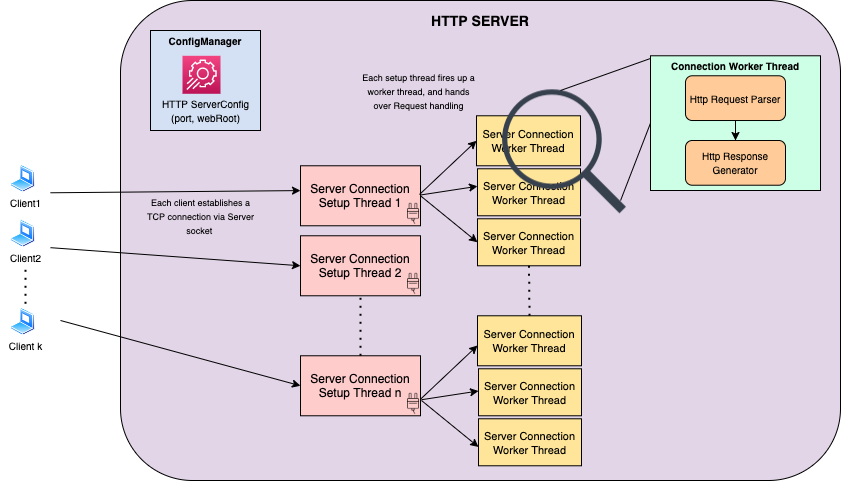

# File-based multi-threaded web server in Java

A multi-threaded (e.g. file-based) web server with thread-pooling implemented in Java.

## Usage/Testing
* Specify the HTTP Server configuration in `src/main/resources/httpServerConfig.json`. By default, the listening HTTP 
port and the root directory for resources is shown below:
```
{
  "port": 8080,
  "webRoot": "src/main/resources/"
}
```
* Open a browser(say, Google Chrome) and try accessing one of the existing files on the server as shown below:
```
http://localhost:8080/httpServerConfig.json
http://localhost:8080/testPage.html
http://localhost:8080/testTextFile.txt
http://localhost:8080/testFolder/testPageInFolder.html
```
You can add additional files/resources if you need to extend.

## Basic Request flow
* Read HTTP Server configuration file to configure HTTP regular port & the web root directory.
* Open a socket to listen at the port.
* Read and parse HTTP Request messages via Input stream.
* Open & read files from the Filesystem for the files browser asks, generate HTTP Response.
* Write HTTP Response messages to Output stream.

## Architecture



## Contributions
While some of the ideas of the architectural design are original to this project, some pieces derive inspiration from 
a similar GitHub project: https://github.com/warchildmd/webserver, especially the HTTP Response handling part.
